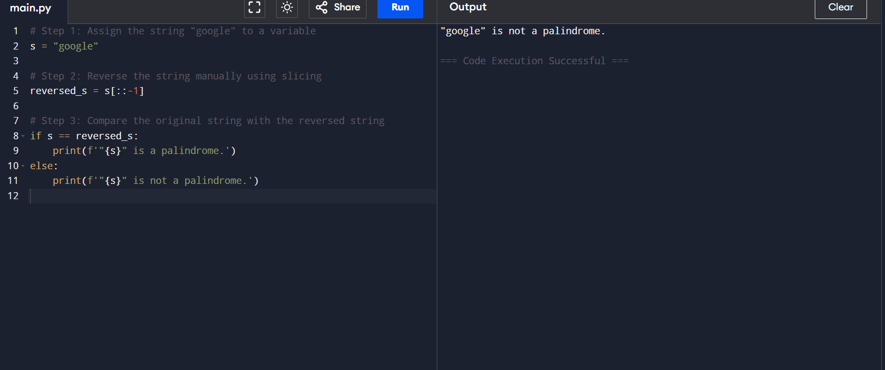
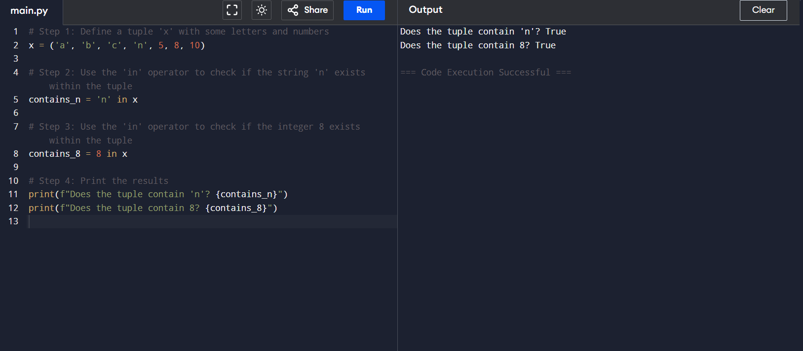

# List Operations in Python: Sum of List Items

## 🎯 Aim
To write a Python program that calculates the **sum of all elements** in a list.

## 🧠 Algorithm
1. Define a list of numbers.
2. Use Python’s built-in `sum()` function to calculate the total.
3. Print the result.

## 🧾 Program
~~~
numbers = [5, 10, 15, 20, 25]

total = sum(numbers)

print("The sum of the list is:", total)
~~~

## Output

## Result
The given program is successfully executed

# Regex in Python: Filter Words Without the Letter 'e'

## 🎯 Aim
To write a Python program that filters out and returns all elements from a list **that do not contain the letter `'e'`**, using **regular expressions (regex)**.

## 🧠 Algorithm
1. Import the `re` module.
2. Initialize an empty list `l1` to store results.
3. Define a list of words:  
   `items = ['goal', 'new', 'user', 'sit', 'eat', 'dinner']`
4. Iterate through each word in the list:
   - Use `re.search(r"e", i)` to check if the word contains `'e'`.
   - If **not**, append the word to `l1`.
5. Print the final filtered list.

## 🧾 Program
~~~
# Step 1: Import the re module
import re

# Step 2: Initialize an empty list 'l1' to store results
l1 = []

# Step 3: Define a list of words
items = ['goal', 'new', 'user', 'sit', 'eat', 'dinner']

# Step 4: Iterate through each word in the list
for i in items:
    # Use re.search() to check if the word contains 'e'
    if not re.search(r"e", i):
        l1.append(i)

# Step 5: Print the final filtered list
print("Words without the letter 'e':", l1)
~~~
## Output

## Result
The given program is successfully executed

# Module-3
# 🧹 Strings-Remove Nth Index Character from a String

## 🎯 Aim
To write a Python program that accepts a string and removes the character at a specified index.

## 🧠 Algorithm
1. Define a function named `remove` that takes the input string as an argument.
2. Read the index `n` from the user input.
3. Initialize an empty string `a` to store the new string.
4. Iterate over each index of the string using a `for` loop.
5. Check if the current index `i` is not equal to `n`.
6. If `i != n`, append the character at index `i` to string `a`.
7. After the loop, return the modified string `a`.
8. Print the final result.

## 💻 Program
~~~
# Step 1: Define a function named 'remove' that takes the input string as an argument
def remove(s):
    # Step 2: Read the index 'n' from the user input
    n = int(input("Enter the index to remove: "))
    
    # Step 3: Initialize an empty string 'a' to store the new string
    a = ""
    
    # Step 4: Iterate over each index of the string using a for loop
    for i in range(len(s)):
        # Step 5 & 6: If i != n, append the character to 'a'
        if i != n:
            a += s[i]
    
    # Step 7: Return the modified string 'a'
    return a

# Step 8: Print the final result
string = input("Enter a string: ")
print("Modified string:", remove(string))

~~~
## Output

## Result
The given program is successfully executed

# Strings-Palindrome Check in Python (Without Built-in Functions)

## 🎯 Aim
To write a Python program to check whether the string `"google"` is a **palindrome** or not, without using built-in palindrome checking functions.

## 🧠 Algorithm
1. Assign the string `"google"` to a variable.
2. Reverse the string manually using slicing (`[::-1]`).
3. Compare the original string with the reversed string.
   - If they are equal, print that the string is a palindrome.
   - Otherwise, print that it is not a palindrome.
4. Execute the program.

## 🧾 Program
~~~
# Step 1: Assign the string "google" to a variable
s = "google"

# Step 2: Reverse the string manually using slicing
reversed_s = s[::-1]

# Step 3: Compare the original string with the reversed string
if s == reversed_s:
    print(f'"{s}" is a palindrome.')
else:
    print(f'"{s}" is not a palindrome.')
~~~
## Output

## Result
The given program is successfully executed

# Tuple in Python: Check Element Existence

## 🎯 Aim
To write a Python program that checks if the element `'n'` and the element `8` exist within a given tuple.

## 🧠 Algorithm
1. Define a tuple `x` with some letters and numbers.
2. Use the `in` operator to check if the string `'n'` exists within the tuple.
3. Use the `in` operator to check if the integer `8` exists within the tuple.
4. Print the results.

## 🧾 Program
~~~
# Step 1: Define a tuple 'x' with some letters and numbers
x = ('a', 'b', 'c', 'n', 5, 8, 10)

# Step 2: Use the 'in' operator to check if the string 'n' exists within the tuple
contains_n = 'n' in x

# Step 3: Use the 'in' operator to check if the integer 8 exists within the tuple
contains_8 = 8 in x

# Step 4: Print the results
print(f"Does the tuple contain 'n'? {contains_n}")
print(f"Does the tuple contain 8? {contains_8}")
~~~

## Output

## Result
The given program is successfully executed

